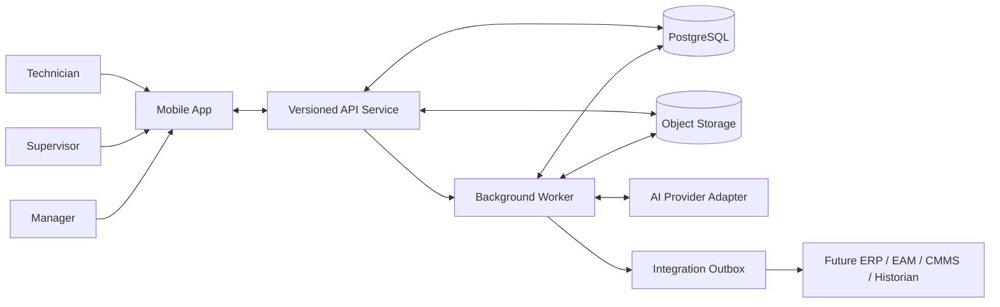

# TagWise Architecture

Status: Approved architecture baseline

Source of truth:
- `_bmad-output/planning-artifacts/product-brief.md`
- `_bmad-output/planning-artifacts/prd.md`
- `docs/MVP/TagWise_Project_Instructions.txt`
- `docs/MVP/TagWise.pdf`

## Architecture Summary
TagWise should be built as a **local-first mobile client** backed by a **single modular backend** with managed storage, background processing, and a strict server-authoritative approval boundary. The recommended shape is intentionally boring:

- one cross-platform mobile app optimized for field use
- one versioned API service
- one background worker service
- one canonical relational database
- one object storage bucket family for evidence/media
- one clean AI adapter boundary
- one outbox/integration boundary for future ERP/EAM/CMMS connections

This architecture is production-ready enough for early industrial deployment, keeps cloud operations simple and low-cost, and preserves the most important product truth: technicians must be able to keep working offline, while review, approval, and canonical record finalization remain controlled on the server.

## Key Decisions And Rationale
- **Local-first mobile data access**: every field-critical screen reads from local storage first, not from live API calls. This is the only reliable way to satisfy the plant connectivity constraint.
- **Per-tag report as canonical sync/review unit**: work packages may contain multiple tags, but each tag report is independently submitted, reviewed, approved, and synced. This keeps lifecycle, sync, audit, and approval semantics manageable.
- **Modular monolith backend**: v1 should use a single deployable backend codebase with clear internal modules, not microservices. This is the best balance of production readiness, cost, and maintainability.
- **PostgreSQL as canonical operational store**: one durable relational store is the simplest way to support approvals, auditability, sync state, template versioning, and future integration contracts.
- **Object storage for evidence/media**: keep binaries out of the transactional database. Store evidence metadata in PostgreSQL and files in object storage.
- **Server-authoritative approvals**: supervisor and manager decisions are connected actions only in v1. This sharply reduces ambiguity around state transitions, audit ordering, and conflict handling.
- **No silent merge on conflicting edits**: v1 should use explicit ownership and server-authoritative conflict rejection rather than automatic merge logic.
- **AI behind an async provider-agnostic boundary**: AI can enrich diagnosis or reporting later, but it never drives deterministic calculations, approval authority, or required workflow behavior.
- **Versioned contracts everywhere that matter**: work-package snapshots, template definitions, report submissions, approval commands, and integration events should all carry explicit schema/version identifiers.

## Architecture Options Considered
### Option A: Local-first mobile + modular monolith backend + managed Postgres + object storage + worker
Summary:
- Cross-platform mobile app with embedded local database and sync engine
- One backend API
- One worker for async jobs
- Managed relational DB
- Object storage for media

Assessment:
- Offline-first reliability: High
- Production readiness: High
- Simplicity / cost: High
- Maintainability: High
- Observability / auditability: High
- Future enterprise integration: High

Pros:
- Strong offline story
- Clear approval boundary
- Simple runtime shape
- Easy to reason about audit trails and sync lifecycles
- Easy to grow into future integrations without re-platforming

Cons:
- Requires disciplined API and sync design from the start
- Less instant scaffolding than a pure BaaS approach

### Option B: BaaS-centered architecture with managed auth/database/storage
Summary:
- Mobile app talks mostly to a BaaS stack for auth, data, and files
- Thin custom backend for approvals and business rules

Assessment:
- Offline-first reliability: Medium
- Production readiness: Medium
- Simplicity / cost: High early, Medium later
- Maintainability: Medium
- Observability / auditability: Medium
- Future enterprise integration: Medium

Pros:
- Faster initial setup
- Less infrastructure to run
- Good fit for basic CRUD and storage

Cons:
- Awkward fit for deterministic sync, approval validation, and enterprise-ready audit semantics
- Can blur boundaries between offline cache and canonical server state
- Harder to keep AI, approvals, and integration contracts cleanly separated over time

### Option C: Event-driven microservices with dedicated sync, approval, media, and AI services
Summary:
- Multiple independently deployed services with message bus and specialized stores

Assessment:
- Offline-first reliability: High
- Production readiness: High
- Simplicity / cost: Low
- Maintainability: Medium
- Observability / auditability: High, but expensive to achieve
- Future enterprise integration: High

Pros:
- Strong long-term separation
- Rich integration flexibility
- Clear service boundaries

Cons:
- Too expensive and operationally heavy for early release
- Slower team velocity
- Overkill for the bounded v1 product

### Recommendation
Recommend **Option A**.

It best fits the actual product: a narrow, production-minded offline field app with auditable approval, simple cloud operations, and clean future integration seams. It gives us the determinism and durability we need without paying the complexity tax of a microservice estate.

## Recommended Architecture
### Runtime Shape
- `mobile-app`: cross-platform mobile client
- `api-service`: versioned backend API and business modules
- `worker-service`: background jobs for media post-processing, AI tasks, outbox delivery, and retryable server-side work
- `postgres`: canonical operational database
- `object-storage`: evidence/media binaries
- `observability stack`: logs, metrics, error reporting, traces

### Recommended Technology Posture
- Mobile client: React Native with TypeScript
- Local structured store: SQLite
- Local secure secrets/tokens: platform secure storage
- Local evidence binaries: app sandbox filesystem
- API service: TypeScript modular monolith with versioned REST endpoints
- Canonical database: PostgreSQL
- Async server jobs: Postgres-backed job queue and worker
- Media store: S3-compatible object storage

The point is not the brand names. The point is the shape: boring, widely understood, and maintainable.

## System Context / Major Components

### Major Components
#### Mobile App
Responsibilities:
- local-first data access
- work-package download
- tag search / QR entry
- deterministic calculations
- history comparison
- checklist/guidance display
- evidence capture
- report drafting
- local outbound sync queue
- sync state display

#### API Service
Responsibilities:
- authentication and token issuance
- work-package download APIs
- tag/report/approval APIs
- sync acceptance and validation
- role enforcement
- audit event creation
- signed upload URL issuance or controlled upload orchestration
- versioned contract enforcement

#### Worker Service
Responsibilities:
- async validation completion
- media verification and evidence finalization
- AI job execution
- integration outbox delivery
- retries for server-side async jobs

#### PostgreSQL
Responsibilities:
- canonical operational data
- approval lifecycle state
- report lifecycle state
- sync status state
- template and guidance versioning
- audit event storage
- integration outbox

#### Object Storage
Responsibilities:
- evidence/media binary storage
- attachment retention
- environment-separated storage

## Data And Domain Architecture
### Domain Boundaries
The architecture should keep these business modules explicit inside the backend:

#### 1. Assignment / Work Package Module
- assigned work packages
- download snapshots
- cache freshness
- work-package roll-up status

#### 2. Tag Context Module
- tag identity and metadata
- instrument family and subtype
- expected range/unit/tolerance
- cached history summary

#### 3. Template / Guidance Module
- instrument family definitions
- test patterns
- checklist templates
- lightweight best-practice / normative snippets
- template versioning

#### 4. Field Execution Module
- test execution records
- deterministic calculations
- result classification
- justification capture
- report drafting

#### 5. Review / Approval Module
- supervisor review
- escalation
- manager approval
- role-based transition rules

#### 6. Sync / Audit Module
- client submission acceptance
- sync status transitions
- audit event creation
- conflict detection

#### 7. AI Assist Module
- AI request records
- provider adapter
- async result linking

#### 8. Integration Boundary Module
- outbox events
- export payload generation
- future ERP/EAM/CMMS connectors

### Canonical Business Objects
The canonical backend model should directly reflect the PRD objects:
- tag / asset context
- assigned work package
- instrument family
- test pattern
- procedure / checklist reference
- history summary
- test execution record
- evidence item
- justification
- per-tag report
- approval decision
- sync status

### Versioned Contracts / Schemas
The following artifacts should carry explicit version identifiers:
- work-package snapshot contract
- template and checklist definitions
- report submission contract
- approval command contract
- audit event schema
- integration outbox events

This allows future enterprise integration without rewriting the core model.

### Modularity For Instrument Family + Test Pattern
Instrument support should be driven by data-backed template definitions, not per-family hard-coded screens. Each template should define at least:
- instrument family
- test pattern
- fields to capture
- calculation mode
- acceptance style
- minimum submission evidence
- expected evidence
- history comparison mode
- checklist/guidance references
- risk signal hints

The mobile app can render a common execution shell while selecting the right family/pattern rules from the local snapshot.

### Lifecycle Ownership
- Report lifecycle is canonical on the server, mirrored on device
- Approval lifecycle is canonical on the server
- Sync lifecycle exists both locally and server-side, but server is authoritative for final acceptance
- Work-package roll-up is derived from child per-tag report states

## Offline / Mobile Architecture
### Local-First Data Access
The mobile app should use a repository layer that always reads from SQLite first. Network requests do not directly power field screens. Instead:
- package download populates local tables
- tag and template data is read locally
- report drafting writes locally
- sync updates local state after server responses

This keeps the field flow stable under poor connectivity.

### Local Database / Storage Choice
Recommended:
- SQLite for structured local data
- secure storage for tokens/session secrets
- sandbox filesystem for evidence binaries

Why SQLite:
- embedded, stable, cheap
- supports structured queries for packages, tags, reports, and queues
- works well for deterministic offline snapshots and per-item state tracking

### Local Storage Partitions
Local data should be partitioned by authenticated user:
- work packages
- drafts
- queued submissions
- evidence metadata
- sync queue

V1 assumes one active authenticated user per device session. Offline user switching is not supported when unsynced records exist.

### Work-Package Download Model
Work packages should download as bounded snapshots containing:
- tag context records
- applicable template definitions
- cached history summaries
- lightweight guidance snippets
- assignment metadata

Snapshots should include:
- package version
- template versions
- freshness timestamp

### Offline Report / Evidence Capture
- drafts are stored locally first
- evidence metadata is stored in SQLite
- evidence binaries are stored in the app sandbox
- local report generation works without network

### Reviewer Connectivity Boundary
- technicians: fully supported offline for execution and local submission queueing
- supervisors/managers: may read already-synced data offline if present, but official review actions are online-only in v1

This is a deliberate simplifying constraint and should remain explicit.

## Sync Architecture
### Sync Model
Use a **deterministic outbound command queue** plus **inbound snapshot refresh** model.

#### Outbound
Queue item types:
- submit report
- upload evidence metadata
- upload evidence binary
- resubmit returned report
- submit AI request intent

Each queue item should carry:
- item type
- local object reference
- object version
- idempotency key
- dependency status
- retry counters

#### Inbound
The app periodically or on demand refreshes:
- work-package status
- report status
- approval outcomes
- refreshed history snapshots
- updated template/guidance snapshots

### Deterministic Sync Behavior
- The app processes outbound items in a fixed dependency order.
- A per-tag report cannot become review-ready until the server accepts it.
- Required evidence binaries gate final transition into review-ready state.
- Optional evidence binaries may continue uploading after report acceptance, but must remain visibly pending if they exist.

### Background Retry Strategy
- retry on app open
- retry on connectivity regain
- retry on explicit user action
- exponential backoff with jitter for transient failures
- permanent failures move the item to `sync issue`

### Per-Item Sync States
Client-visible states:
- local only
- queued
- syncing
- pending validation
- synced
- sync issue

### Conflict Handling Strategy
V1 should avoid merge-heavy behavior by combining single-writer ownership with explicit rejection.

Rules:
- technician owns report content until submit
- once submitted and accepted, report content is immutable until returned
- reviewers create approval decisions; they do not edit field evidence or calculations
- no silent merge of competing changes
- conflicting updates result in `sync issue` and require refresh/rework

### Server-Authoritative Rules
The server is authoritative for:
- official report acceptance
- approval transitions
- escalation transitions
- role validation
- audit finalization
- conflict resolution

### Pending Validation Flow
1. Client submits report and dependencies.
2. Server receives payload and records `pending validation`.
3. Server validates:
- schema version
- scope/identity
- allowed state transition
- minimum submission evidence
- required justification
- required evidence binary arrival
4. On success, report enters `Submitted - Pending Supervisor Review`.
5. On failure, item enters `sync issue` with a structured reason.

## Approval / RBAC / Audit Architecture
### Identity Architecture
Start with a simple backend-owned auth module with an OIDC-ready adapter boundary for later enterprise SSO.

V1 baseline:
- connected login required before offline work
- short-lived access token + refresh token
- tokens stored in secure storage
- role assignments stored server-side
- local role cache only supports offline technician experience, not authoritative review actions

### RBAC Model
Roles:
- Technician
- Supervisor
- Manager

Scope:
- technicians: assigned work packages / team scope
- supervisors: routed review queue for those packages
- managers: explicitly escalated queue

### Approval Service Architecture
Approval should be implemented as a dedicated backend module with:
- explicit command validation
- state transition rules
- required comments for returns and escalations
- append-only approval decision history

### Audit Event Architecture
Every critical action should emit a durable audit event:
- work package downloaded
- report submitted
- report returned
- report escalated
- report approved
- evidence uploaded
- sync issue created/resolved
- AI result attached if persisted

Audit events should include:
- actor id
- actor role
- action type
- target object type/id
- timestamp
- prior state
- next state
- comment/rationale if present
- correlation ids for report/work package

Audit events belong in PostgreSQL in v1, not a separate event platform.

## Evidence / Media Architecture
### Local Capture
- mobile app stores binaries in sandbox filesystem
- metadata row created locally in SQLite
- metadata linked to tag, report, and step

### Upload Flow
Recommended v1 flow:
1. report/evidence metadata syncs to API
2. API issues upload authorization for each pending binary
3. mobile client uploads binary to object storage
4. API or worker verifies upload and finalizes evidence state

This keeps API instances from becoming binary streaming bottlenecks.

### Secure Handling
- restrict file types and size
- use short-lived upload authorizations
- store metadata separately from binary
- keep object storage private by default
- expose downloads through authenticated access policy or signed access

### Metadata Model
Each evidence item should track:
- report id
- tag id
- evidence type
- local capture timestamp
- uploader
- binary presence status
- sync status
- content type
- size
- checksum/hash if used

## AI Boundary Architecture
### Architecture Principle
AI is a separate async assist layer, never part of deterministic business logic.

### Request Pattern
1. technician triggers AI assist or product marks AI assist pending
2. local intent can be queued offline
3. once synced, backend creates AI job record
4. worker prepares provider-agnostic request payload
5. provider adapter calls external model/service
6. result stored as AI suggestion artifact linked to report

### Pending AI Result Behavior
- report can proceed without AI
- approval can proceed without AI
- missing AI result is never a blocking state
- AI result arrival after submission is additive, not state-changing by itself

### Provider-Agnostic Boundary
Define an internal AI adapter contract around:
- request type
- input payload
- result artifact
- error status
- provider metadata

This allows swapping providers without touching report, approval, or sync logic.

### Separation From Deterministic Logic
Never use AI for:
- approval authority
- required pass/fail calculation
- role validation
- canonical state transition decisions

## Deployment Architecture
### Recommended Early Deployment Path
Use a **single-region managed container deployment** with:
- one API service
- one worker service
- managed PostgreSQL
- managed object storage
- managed secrets/config
- managed logging/error monitoring

This is the right early-production balance: cheap enough to run, strong enough to audit, and easy to evolve.

### Environments
- local dev: mobile simulator/device + local API/DB/object-storage emulation where practical
- staging: production-like single region, smaller scale
- production: single region, managed backups, monitored services

### Runtime Shape
- API and worker run from the same codebase as separate processes or services
- PostgreSQL is the only canonical transactional store
- object storage holds evidence binaries
- no separate cache cluster required in v1
- no message bus required in v1

### Storage Posture
- PostgreSQL: transactional data, audit events, sync state, outbox, template versions
- object storage: evidence/media only
- mobile SQLite: offline snapshot + local work-in-progress + outbound queue

### Operational Assumptions
- early release concurrency is modest
- one region is acceptable for v1
- RPO/RTO targets are practical rather than enterprise-premium
- integration needs are deferred to outbox/export shape rather than real-time bidirectional sync

## Observability / Security / Resilience
### Logs
- structured JSON logs from API and worker
- correlation ids for work package, report, and request
- explicit sync and approval transition logs

### Metrics
Track at minimum:
- package download success/failure
- offline submission queue depth
- sync success rate
- report validation failures
- approval latency
- escalation rate
- evidence upload failures
- AI job success/failure

### Traceability
- every report and approval action should be traceable end-to-end across API, worker, audit event, and sync lifecycle
- correlation ids should follow report submission through approval and outbox events

### Security Baseline
- TLS for all network traffic
- hashed passwords or federated auth adapter
- secure token storage on device
- per-user local data partitioning
- private object storage
- least-privilege service credentials
- environment-scoped secrets
- routine backups for PostgreSQL and object storage

### Device / Session Boundaries
- one active authenticated user per device session
- offline user switching disabled when unsynced work exists
- remote session invalidation should take effect on next connected token refresh

### Resilience Concerns
- app restarts must not lose drafts or queued submissions
- background sync must tolerate intermittent network
- worker restarts must not lose in-flight server jobs
- API outage must not block technician completion offline
- object storage outage should delay evidence finalization, not destroy local evidence

## Risks, Tradeoffs, And Open Questions
### Risks
- local-first sync logic can still become too clever if draft syncing or reviewer offline behavior is expanded too early
- template sprawl may erode the shared execution model
- evidence/media requirements can slow field use if allowed to grow without discipline
- a weak upstream assignment/data feed can undermine field trust even with good app behavior

### Tradeoffs
- We accept online-only official review actions in v1 to keep approval and audit deterministic.
- We choose a modular monolith over microservices to reduce cost and increase delivery speed.
- We choose object storage plus metadata separation over storing binaries in PostgreSQL.
- We choose server-authoritative conflict rejection over auto-merge convenience.
- We choose a versioned template system over one-off per-family screens.

### Open Questions
- Should v1 support report export as PDF, structured JSON, or both?
- What enterprise identity mode is most likely first: local accounts, customer SSO, or both?
- How much optional evidence can remain pending after minimum evidence acceptance before reviewers find the workflow confusing?
- What retention policy should apply to evidence binaries in early production?

## Architecture Handoff Statement
This architecture keeps the approved PRD boundaries intact. It is local-first for technicians, server-authoritative for approval, simple enough for early production, and structured to evolve toward future enterprise integration without re-platforming. It is ready to feed epics and stories.
